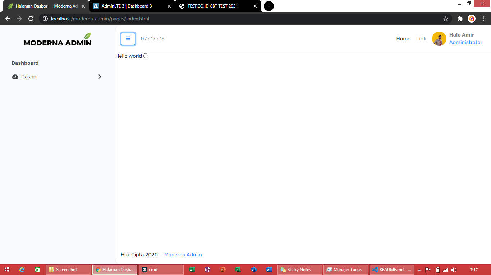

# Moderna Administrator Template

Moderna admin adalah sebuah template administrator yang responsif dan elegan yang dibangun diatas kerangka kerja [Bootstrap 4.6](https://getbootstrap.com). Admin template ini dibawah perlindungan Lisensi [MIT](./LICENSE) dan kami harap anda membaca terlebih dahulu.

| Detail        |                                                        |
|---------------|--------------------------------------------------------|
| Pengembang    | [Dasa Kreativa Studio](https://www.dasakreativa.my.id) |
| Versi         | 0.1.1                                                  |
| Tanggal Rilis | 04 Maret 2021                                          |
| Status        | Non-Stable Release Candidate                           |

 

# Lisensi
Template ini dibangun dan diazaskan pada lisensi [MIT](./LICENSE).

# Kredit Gambar dan Pihak Ketiga
1. [Unsplash](https://www.unsplash.com)
2. [jQuery Validation](https://jqueryvalidations.com)
3. [FontAwesome 5.x](https://fontawesome.com)
4. [MetisMenu](https://github.com/onokumus/metismenu)
